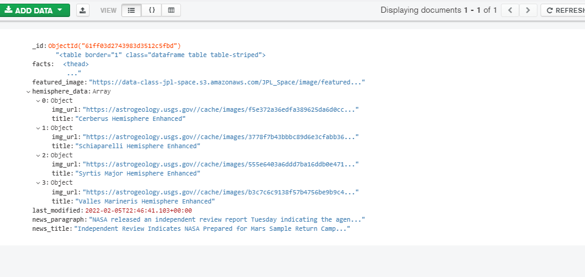
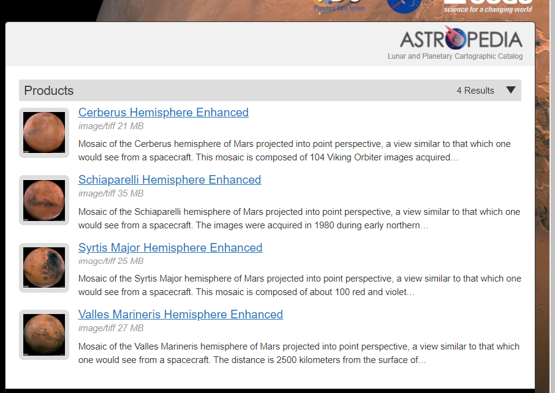
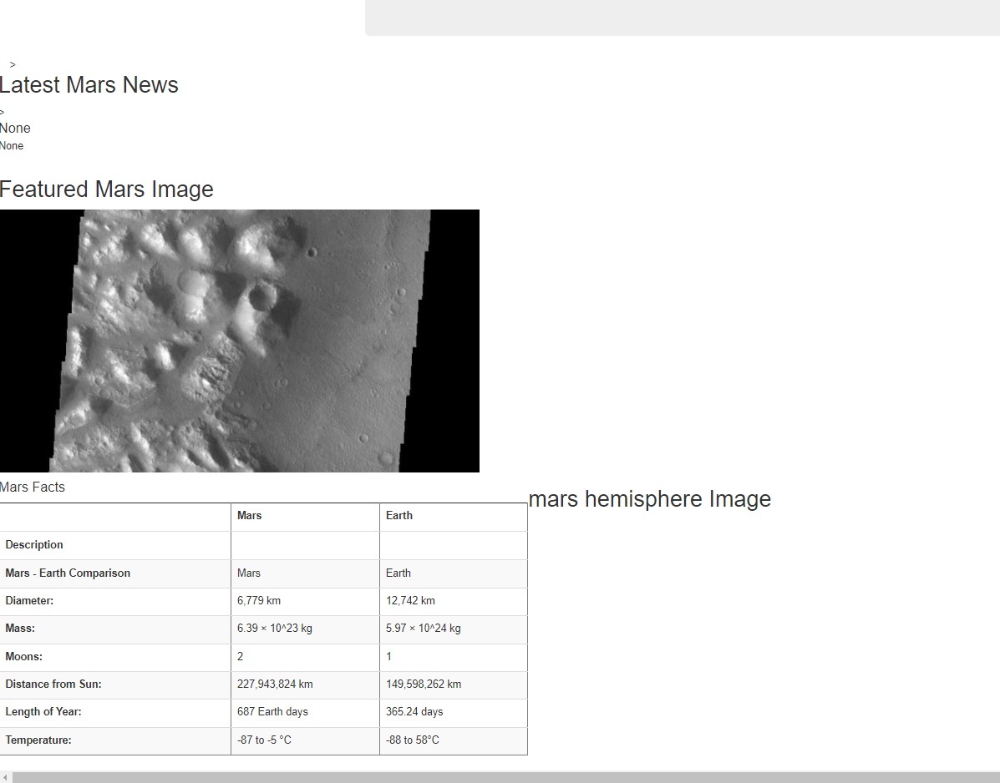

# Mission-to-Mars
## Overview
   The ourpose of the project is to extract data from NASA's website using Chrome Developer tools to analyse HTML code,Beautiful soup and Splinter to automate web brower when we begin the scraping;Mongo database to store data,and a web application named Flask to display the data.Using above  mentioned tools an app was developed to scrape informations like latest news from NASA; Featured image,facts about mars and hemisphere images.
   
## Results
### Using above tools web scraping from NASA was achieved using Jupyter Notebook and updated the web app with Mar's Hemisphere Images and titles through 
### Deliverable 1,where created a data dictionary.

 #### URL

##### Title with images

### Mongo database  was used to store the data ,integrated into web app ,so that data is displayed when everytime when scraping.py run.

  #### Flask display data 

